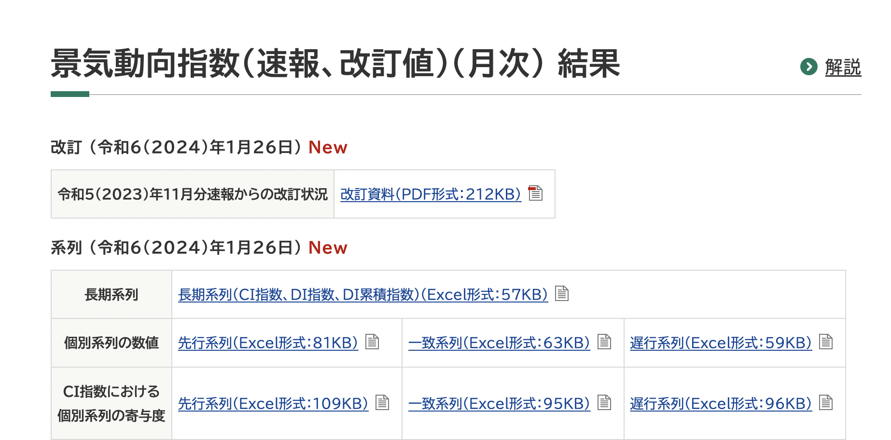

# scraping_estat

## ダウンロード元について

### 訪日外客数
以下のエクセルからダウンロード

https://www.jnto.go.jp/statistics/data/visitors-statistics/

### 景気動向指数
以下の長期系列からダウンロード

https://www.esri.cao.go.jp/jp/stat/di/di.html

### 完全失業率
以下の1-a-1からダウンロード

https://www.e-stat.go.jp/stat-search/files?page=1&layout=datalist&toukei=00200531&tstat=000000110001&cycle=0&tclass1=000001040276&tclass2=000001011681&tclass3val=0

### 実質賃金

### 実質収入
以下からダウンロード

https://www.e-stat.go.jp/stat-search/files?page=1&layout=datalist&toukei=00450071&tstat=000001011791&cycle=0&tclass1=000001035519&tclass2=000001144287&stat_infid=000032189740&tclass3val=0

### 消費者物価指数
以下1の中分類指数からダウンロード

https://www.e-stat.go.jp/stat-search/files?page=1&layout=datalist&toukei=00200573&tstat=000001150147&cycle=0&tclass1=000001150151&tclass2=000001150152&tclass3=000001150153&tclass4=000001150156&tclass5val=0

